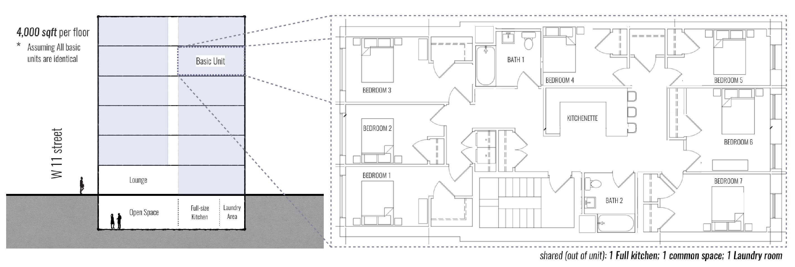

# Co-living_Greenwich-Village_NYC
First pass revenue projection for hotel conversion to co-housing in Greenwich Village

## Motivation:
The goal of this project is to make a first pass projection of the revenue and risks of a hotel located in Greenwich Village, NYC, being converted into 77 units co-living residential housing, using different public data sources. Assume that there is no construction risk.

## Project Highlights:
- Unique NYC location in the heart of Greenwich Village steps away from Union Square, the West Village, the East Village, Soho and the Lower East Side
- Almost built to suit product with a kitchenette per every 7 bedrooms and large communal space on the basement level
- NYC has seen a tremendous rise in the number of co-living building but this is uniquely positioned within the city 

### Gross Area: Approximately 24,000 sf

### # of Units: 77 Co-Living Units

### Listing Date: August 1st 2018

### Communal Space Rations:
    1. 1 Small Kitchenette per 7 bedrooms
    2. 1 Bathroom per every 3.5 bedrooms
    3. 1 full size kitchen per 77 bedrooms
    4. 1 Lounge per 25 bedrooms
    5. 1 Open Space per 77 bedrooms
    6. 1 Laundry area per 77 bedrooms
    

